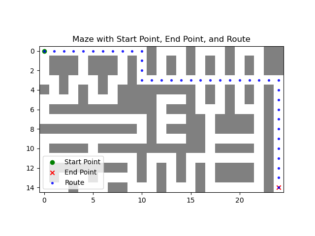
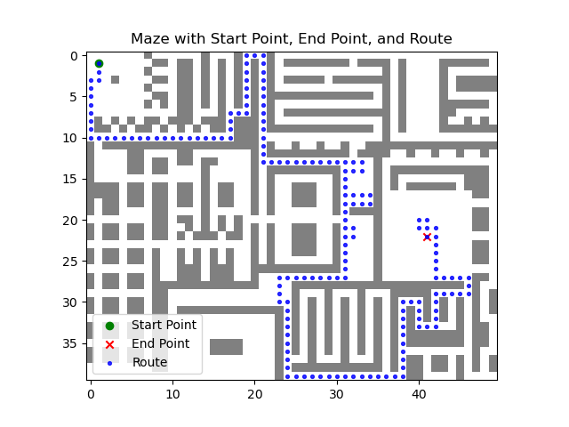
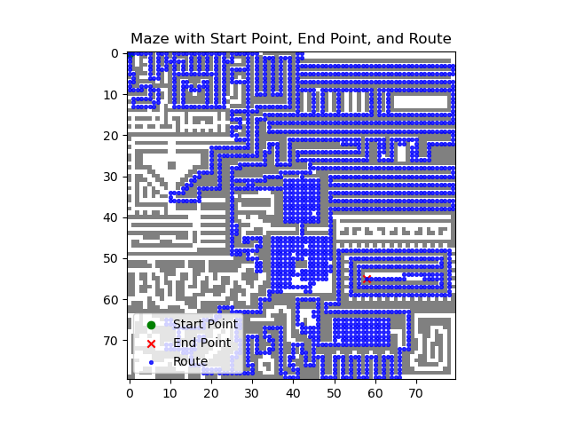

# Maze Solver

## Overview

This repository contains an implementation of an Ant Colony Optimization (ACO) algorithm for solving mazes. The algorithm employs a population of ants to explore and find the shortest path from the start to the end of the maze.

For the results of the algorithm, the average and best route lengths over multiple generations are plotted. Additionally, the best route found by the algorithm is visualized.

## Features

- Ant Colony Optimization algorithm for maze solving.
- Pheromone-based exploration and exploitation strategy.
- Dynamic adjustment of pheromones based on route lengths.
- Visualization of average and best route lengths over multiple generations.
- Visualization of the best route found by the algorithm.
- Baseline algorithm (Breadth-First Search) for comparision

## Getting Started

### Prerequisites

- Python 3.x
- Required Python packages (install using `pip install -r requirements.txt`):

### Usage

1. Clone the repository:

   ```bash
   git clone https://github.com/your-username/ant-colony-maze-solver.git
   ```

1. For finding the best route, run the following command in the terminal to compile the program:

   ```bash
   python src/AntColonyOptimization_test.py <difficulty>
   ```

1. For visualizing the results, run the following command in the terminal:

   ```bash
   python src/Visualizer.py <difficulty>
   ```

remarks:

- `<difficulty>`: easy, medium, hard, insane

## Results

### Easy Maze



### Medium Maze



### Hard Maze


